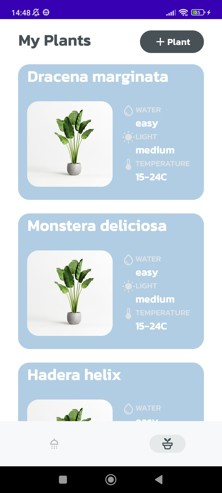

# WateringReminder

## Description

WateringReminder is a mobile application that helps users manage their flower collection. With this app, you can add your favorite flowers to your collection and set watering schedules for each of them.

## Features

- **Add Flowers**: You can add your flowers to your collection along with information such as name, location, and watering preferences.
- **Watering Schedule**: For each flower, you can set a watering schedule by specifying the time interval (e.g., every 2 days, weekly, etc.) at which it should be watered.
- **Collection Overview**: You have access to an overview of your flower collection, where you can view information about each flower and check if watering time is approaching.
- **Removal**: You can remove flowers from your collection.

## Features in progress

- **Add Flowers Layout**: When the layout is finished, the new fields species, description, photos will be added,
- **Editing**: You can edit flower information in your collection.
- **Notifications**: The app sends reminders to water the flowers according to the defined watering schedule.

## Technologies

WateringReminder is built using the following technologies:

- Programming Language: Java/Kotlin
- Android Framework:
  - [Jetpack Compose](https://developer.android.com/jetpack/compose): A modern toolkit for building native Android UI.
  - [Room](https://developer.android.com/jetpack/androidx/releases/room): An Android library that provides an abstraction layer over SQLite for database access.
  - [Coroutines](https://developer.android.com/kotlin/coroutines): A Kotlin library for writing asynchronous, non-blocking code.
  - [MockK](https://mockk.io/): A mocking library for Kotlin used for testing.
  - [Koin](https://insert-koin.io/): A lightweight dependency injection framework for Kotlin.
- Architecture Pattern:
  - MVVM (Model-View-ViewModel): A software architectural pattern that separates the development of the graphical user interface (View) from the business logic and data (Model and ViewModel) in an application.
- Libraries:
  - [Material Design 3](https://material.io/design): A design system developed by Google for creating visually appealing user interfaces.

## License

This project is based on the work of a Talented Artist - [Maryna Serohina](https://www.behance.net/gallery/81051045/Plants-Need-Water-Mobile-App-Concept): and is licensed under the following license:
Attribution-NonCommercial-NoDerivatives 4.0 International (CC BY-NC-ND 4.0)

## Information about the appearance of the application

Some visual elements of the app, such as icons, images, and colors, have been modified to suit the project's needs. The following is a list of the changes:

- Some icons have been replaced with customized icons to suit the project.
- Original images have been replaced with publicly available or self-created equivalents.
- The colors of the application have been adjusted to align with other interface elements.

These changes have been made due to the lack of access to the original visual elements and in accordance with the terms of the licence, which prohibits the creation of derivative works.

## Note on usage

This app is not intended for commercial use. It is a project created for the purposes of a programming portfolio, demonstrating skills and functionality. The graphic design, including modified visual elements, is for demonstration and representative purposes of design skills only.
